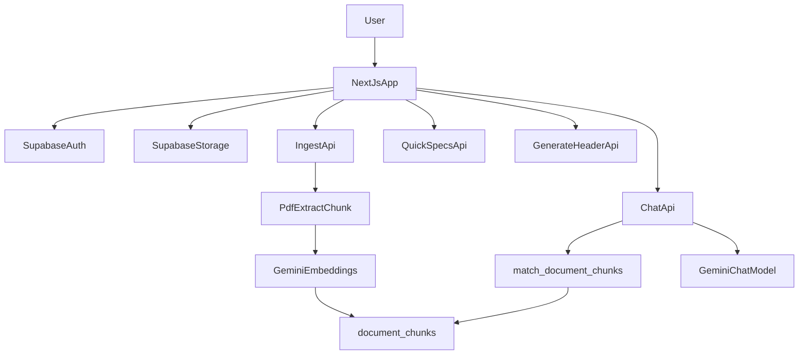

# Spec2Code

A Next.js app for working with hardware datasheets: upload PDFs, ingest them into a vector index, chat with source-grounded answers, generate quick technical specs, and draft C++ headers.

## Features

- PDF upload to Supabase Storage with per-user scoping.
- Ingestion pipeline: PDF extraction -> chunking -> Gemini embeddings -> `document_chunks`.
- RAG chat over ingested documents with streamed responses and citation metadata.
- Quick specs generation as markdown tables from ingested chunks.
- C++ header generation from ingested chunks.
- Supabase auth + middleware-protected routes with user isolation.

## Architecture Overview



### High-level flow

1. User signs in with Supabase Auth.
2. User uploads PDF(s) into Supabase bucket `Spec-sheets` under `uploads/<user_id>/...`.
3. Ingestion API extracts text, chunks it, generates embeddings, and stores rows in `document_chunks`.
4. Chat API embeds the query, retrieves relevant chunks via `match_document_chunks`, and streams a Gemini answer.
5. Quick Specs and Generate Header APIs read ingested chunks and produce specialized outputs.

## Tech Stack

- Framework: Next.js 16 (App Router), React 19, TypeScript
- Styling/UI: Tailwind CSS v4, shadcn UI/Radix-based components
- Auth + data + storage: Supabase (`@supabase/ssr`, `@supabase/supabase-js`)
- AI: Google Generative AI (Gemini chat + embeddings)
- PDF parsing: `pdf-parse`
- Vector search: Postgres + `pgvector` + Supabase SQL RPC

## Prerequisites

- Node.js current LTS (recommended for Next.js 16 compatibility)
- npm (repo includes `package-lock.json`)
- Supabase project (database + storage + auth)
- Google AI API key for Gemini

## Environment Variables

Create `.env.local` in the project root:

```bash
NEXT_PUBLIC_SUPABASE_URL=your_supabase_project_url
NEXT_PUBLIC_SUPABASE_ANON_KEY=your_supabase_anon_key
SUPABASE_SERVICE_ROLE_KEY=your_supabase_service_role_key
GOOGLE_API_KEY=your_google_api_key
```

Notes:

- `NEXT_PUBLIC_SUPABASE_URL` and `NEXT_PUBLIC_SUPABASE_ANON_KEY` are used by browser, middleware, and server session clients.
- `SUPABASE_SERVICE_ROLE_KEY` is used server-side for privileged database operations.
- `GOOGLE_API_KEY` is required for chat, embeddings, quick specs, and header generation.

## Installation and Run

Install dependencies:

```bash
npm install
```

Run development server:

```bash
npm run dev
```

Build for production:

```bash
npm run build
```

Start production server locally:

```bash
npm run start
```

Run linting:

```bash
npm run lint
```

## Supabase Setup

### 1) Enable required extension and schema

Apply SQL migrations in `supabase/migrations` in numeric order:

1. `001_create_document_chunks.sql`
2. `002_match_chunks_function.sql`
3. `003_authenticated_access_document_chunks_and_storage.sql`
4. `004_add_user_id_to_document_chunks.sql`
5. `005_user_scoped_policies.sql`
6. `006_match_chunks_user_scope.sql`
7. `007_match_chunks_include_page.sql`

Important migration outcomes:

- `pgvector` extension is enabled.
- `document_chunks` stores embeddings as `vector(768)`.
- `match_document_chunks` RPC supports per-user filtering and returns page metadata.
- Row-level security and storage policies are configured for user-scoped access.

### 2) Create Storage bucket

Create a Supabase Storage bucket named exactly:

- `Spec-sheets`

The app uploads files under:

- `uploads/<user_id>/<uuid>-<original_filename>.pdf`

### 3) Ensure auth is enabled

The app requires authenticated users for all routes except `/login`.

## Usage Workflow

1. Sign up or sign in at `/login`.
2. Upload one or more PDFs from the sidebar uploader.
3. Click **Run ingestion** to process uploaded files.
4. Ask questions in chat to get source-grounded responses.
5. Open file actions to:
   - Generate code (C++ header)
   - Generate quick specs (markdown table)

## API Routes

- `POST /api/ingest`
  - Body: `{ "storagePath": "uploads/<user_id>/<file>" }`
  - Behavior: extracts/chunks/embeds PDF and upserts chunk rows for the user.

- `POST /api/chat`
  - Body: `{ "query": "..." }`
  - Behavior: retrieves top relevant chunks, streams plain-text response, includes citations in `x-chat-sources` header.

- `POST /api/quick-specs`
  - Body: `{ "storagePath": "uploads/<user_id>/<file>" }`
  - Behavior: reads ingested chunks and returns a quick specs markdown output.

- `POST /api/generate-header`
  - Body: `{ "storagePath": "uploads/<user_id>/<file>" }`
  - Behavior: reads ingested chunks and returns generated C++ header text.

All endpoints require authenticated users and enforce user-scoped document access.

## Project Structure

```text
app/
  api/
    chat/route.ts
    ingest/route.ts
    quick-specs/route.ts
    generate-header/route.ts
  login/page.tsx
  page.tsx
src/
  components/
    UploadPdf.tsx
    FileList.tsx
    DocumentChat.tsx
  contexts/
    document-chat-context.tsx
  lib/
    ingest/
    retrieval/
    supabase/
hooks/
  use-document-chat.ts
supabase/
  migrations/
middleware.ts
```

## Troubleshooting

- `Missing env var GOOGLE_API_KEY`
  - Add `GOOGLE_API_KEY` to `.env.local`, restart dev server.

- `match_document_chunks RPC is missing`
  - Apply latest migrations, especially `006_match_chunks_user_scope.sql` and `007_match_chunks_include_page.sql`.

- `No ingested text found for this file`
  - Upload and run ingestion first; ensure `storagePath` belongs to the signed-in user.

- Unauthorized or redirect loop issues
  - Verify Supabase URL/anon key and that auth session cookies are being set.

- Ingestion timeout on large PDFs
  - Retry with smaller files or split large documents before ingesting.

## Future Improvements

- Add `.env.example` for faster onboarding.
- Add automated migration/bootstrap script for local setup.
- Add end-to-end tests for upload -> ingest -> chat and generation flows.
- Add deployment notes for production hosting and secrets management.
