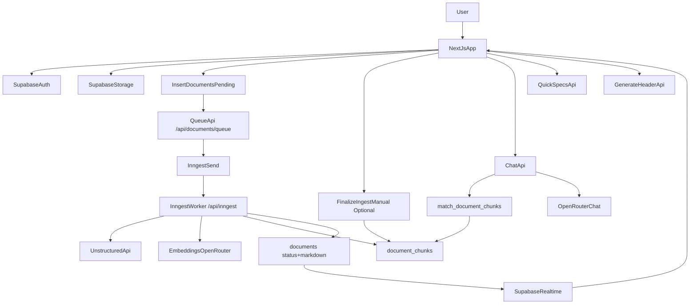

# Spec2Code

A Next.js app for working with hardware datasheets: upload PDFs, ingest them into a vector index, chat with source-grounded answers, generate quick technical specs, and draft C++ headers.

## Features

- PDF upload to Supabase Storage with per-user scoping.
- Non-blocking ingestion pipeline: upload + queue -> Supabase Edge Function -> Unstructured markdown extraction.
- RAG chat over ingested documents with streamed responses and citation metadata.
- Quick specs generation as markdown tables from ingested chunks.
- C++ header generation from ingested chunks.
- Supabase auth + middleware-protected routes with user isolation.

## Architecture Overview



### High-level flow

1. User signs in with Supabase Auth.
2. User uploads PDF(s) into Supabase bucket `Spec-sheets` under `uploads/<user_id>/...`.
3. Client inserts a `documents` row with status `pending`, then calls **`/api/documents/queue`** to emit an Inngest event.
4. The **Inngest** job (`document/ingest.requested`) runs on your app: **Unstructured** (markdown) or **pdf-parse** fallback, then **embeddings + `document_chunks`**, updating **`documents`** to `completed` / `failed` in one pipeline.
5. Frontend listens via Supabase Realtime and updates status without blocking on parsing.
6. **Disable** the legacy Supabase DB webhook for `documents` after cutover (otherwise Edge + Inngest would both run). See [implementation_plan.md](implementation_plan.md).
7. Chat/Quick Specs/Header APIs use `document_chunks`; **`/api/documents/finalize-ingest`** remains available as a manual repair path if needed.

## Tech Stack

- Framework: Next.js 16 (App Router), React 19, TypeScript
- Styling/UI: Tailwind CSS v4, shadcn UI/Radix-based components
- Auth + data + storage: Supabase (`@supabase/ssr`, `@supabase/supabase-js`)
- AI: OpenRouter (OpenAI-compatible chat + embeddings)
- PDF parsing: `pdf-parse`
- Vector search: Postgres + `pgvector` + Supabase SQL RPC

## Prerequisites

- Node.js current LTS (recommended for Next.js 16 compatibility)
- npm (repo includes `package-lock.json`)
- Supabase project (database + storage + auth)
- OpenRouter API key

## Environment Variables

Create `.env.local` in the project root:

```bash
NEXT_PUBLIC_SUPABASE_URL=your_supabase_project_url
NEXT_PUBLIC_SUPABASE_ANON_KEY=your_supabase_anon_key
SUPABASE_SERVICE_ROLE_KEY=your_supabase_service_role_key
OPENROUTER_API_KEY=your_openrouter_api_key
UNSTRUCTURED_API_KEY=your_unstructured_api_key

# Inngest (production / hosted deploy). Local: run `npx inngest-cli@latest dev` with your Next dev server.
# INNGEST_EVENT_KEY=…        # used when your app calls inngest.send (e.g. /api/documents/queue)
# INNGEST_SIGNING_KEY=…     # used by serve() on /api/inngest so Inngest Cloud can authenticate to your app
# See also [.env.example](.env.example).

# Optional: verify DB webhook requests (legacy Edge path — set as Edge secret INGEST_WEBHOOK_SECRET — not SUPABASE_*)
# INGEST_WEBHOOK_SECRET=choose_a_long_random_secret

# Optional model overrides (defaults shown):
# OPENROUTER_CHAT_MODEL=openai/gpt-4o-mini
# OPENROUTER_EMBEDDING_MODEL=openai/text-embedding-3-small
# OPENROUTER_METADATA_MODEL=openai/gpt-4o-mini
# OPENROUTER_HTTP_REFERER=https://your-app-domain.com
# OPENROUTER_APP_NAME=Spec2Code
```

Notes:

- `NEXT_PUBLIC_SUPABASE_URL` and `NEXT_PUBLIC_SUPABASE_ANON_KEY` are used by browser, middleware, and server session clients.
- `SUPABASE_SERVICE_ROLE_KEY` is used server-side for privileged database operations.
- `OPENROUTER_API_KEY` is required for chat, embeddings, quick specs, and header generation.
- `UNSTRUCTURED_API_KEY` is required by the async ingestion Edge Function (set via `supabase secrets set`).
- **Do not** try to set `SUPABASE_SERVICE_ROLE_KEY` (or any `SUPABASE_*` name) with `supabase secrets set`; the CLI skips those. Hosted functions already receive `SUPABASE_URL` and `SUPABASE_SERVICE_ROLE_KEY` automatically.
- Optional webhook verification: set secret `INGEST_WEBHOOK_SECRET` and send the same value in header `x-webhook-secret` from the Database Webhook.
- `OPENROUTER_CHAT_MODEL`, `OPENROUTER_EMBEDDING_MODEL`, and `OPENROUTER_METADATA_MODEL` are optional overrides for the default models.

## Installation and Run

Install dependencies:

```bash
npm install
```

Run development server:

```bash
npm run dev
```

Build for production:

```bash
npm run build
```

Start production server locally:

```bash
npm run start
```

Run linting:

```bash
npm run lint
```

## Supabase Setup

### 1) Enable required extension and schema

Apply SQL migrations in `supabase/migrations` in numeric order:

1. `001_create_document_chunks.sql`
2. `002_match_chunks_function.sql`
3. `003_authenticated_access_document_chunks_and_storage.sql`
4. `004_add_user_id_to_document_chunks.sql`
5. `005_user_scoped_policies.sql`
6. `006_match_chunks_user_scope.sql`
7. `007_match_chunks_include_page.sql`

Important migration outcomes:

- `pgvector` extension is enabled.
- `document_chunks` stores embeddings as `vector(768)`.
- `match_document_chunks` RPC supports per-user filtering and returns page metadata.
- Row-level security and storage policies are configured for user-scoped access.

### 2) Create Storage bucket

Create a Supabase Storage bucket named exactly:

- `Spec-sheets`

The app uploads files under:

- `uploads/<user_id>/<uuid>-<original_filename>.pdf`

### 3) Ensure auth is enabled

The app requires authenticated users for all routes except `/login`.

### 4) Deploy async ingestion edge function

Deploy the worker:

```bash
supabase functions deploy ingest-document
```

Set function secrets:

```bash
npx supabase secrets set UNSTRUCTURED_API_KEY=your_key

# Optional (webhook HMAC-style shared secret — must not start with SUPABASE_)
npx supabase secrets set INGEST_WEBHOOK_SECRET=your_long_random_string
```

**RAG finalize (chunks + category tags + Quick Specs):** After Unstructured writes `markdown_content`, the app must run chunking + OpenRouter embeddings + metadata extraction.

- **Default (no extra secrets):** While you’re signed in, the client **automatically** calls `POST /api/documents/finalize-ingest` for any row that is `completed` but still has `chunk_count = 0`. That uses your normal session cookie — you do **not** need `INGEST_FINALIZE_*` for local dev.

- **Optional (Edge calls Next in production):** You can still set `INGEST_FINALIZE_URL` + `INGEST_FINALIZE_SECRET` on the Edge function so finalize runs immediately after parse without waiting for an open browser tab:

   1. Add `INGEST_FINALIZE_SECRET` to **Vercel / `.env.local`**.
   2. `npx supabase secrets set INGEST_FINALIZE_URL="https://your-app.vercel.app"` and matching `INGEST_FINALIZE_SECRET`.

   `INGEST_FINALIZE_URL` must be a **public** HTTPS origin (not `localhost`).

Configure a Supabase **Database Webhook**:

- Table: `public.documents`
- Event: `INSERT`
- URL: `https://<project-ref>.functions.supabase.co/ingest-document`
- Secret header: `x-webhook-secret` (same value as Edge secret `INGEST_WEBHOOK_SECRET`, if you use it)

## Usage Workflow

1. Sign up or sign in at `/login`.
2. Upload one or more PDFs from the sidebar uploader.
3. Upload PDF(s); ingestion is queued immediately and processing continues in the background.
4. Watch realtime status updates (`pending -> processing -> completed/failed`) in the UI (with RAG finalize configured, chunk count and category tags update automatically).
5. Ask questions in chat to get source-grounded responses.
6. Open file actions to:
   - Generate code (C++ header)
   - Generate quick specs (markdown table)

## API Routes

- `POST /api/ingest` (optional/manual indexing path)
  - Body: `{ "storagePath": "uploads/<user_id>/<file>" }`
  - Behavior: extracts/chunks/embeds PDF and upserts chunk rows for the user.

- `POST /api/documents/finalize-ingest`
  - **Session:** signed-in user; body `{ "documentId": "<uuid>" }` — must own the document. No shared secret required.
  - **Internal:** header `x-ingest-finalize-secret` matching `INGEST_FINALIZE_SECRET` (Edge Function calling production URL).
  - Behavior: reads `markdown_content`, chunks, embeds, sets `document_chunks` and datasheet metadata (category/tags). Needs `OPENROUTER_API_KEY` on the Next.js server.

- `POST /api/documents/trigger-ingest` (authenticated)
  - Body: `{ "documentId": "<uuid>" }`
  - Behavior: calls the `ingest-document` Edge Function again with a webhook-shaped payload. Use if a row stays in **`processing`** (“Indexing”) after a failed or timed-out run (INSERT webhooks do not fire twice for the same row).

Optional: set `INGEST_WEBHOOK_SECRET` in `.env.local` to match the Edge secret when your function validates `x-webhook-secret`.

- `POST /api/chat`
  - Body: `{ "query": "..." }`
  - Behavior: retrieves top relevant chunks, streams plain-text response, includes citations in `x-chat-sources` header.

- `POST /api/quick-specs`
  - Body: `{ "storagePath": "uploads/<user_id>/<file>" }`
  - Behavior: reads ingested chunks and returns a quick specs markdown output.

- `POST /api/generate-header`
  - Body: `{ "storagePath": "uploads/<user_id>/<file>" }`
  - Behavior: reads ingested chunks and returns generated C++ header text.

All endpoints require authenticated users and enforce user-scoped document access.

## Project Structure

```text
app/
  api/
    chat/route.ts
    ingest/route.ts
    quick-specs/route.ts
    generate-header/route.ts
  login/page.tsx
  page.tsx
src/
  components/
    UploadPdf.tsx
    FileList.tsx
    DocumentChat.tsx
  contexts/
    document-chat-context.tsx
  lib/
    ingest/
    retrieval/
    supabase/
hooks/
  use-document-chat.ts
supabase/
  migrations/
middleware.ts
```

## Troubleshooting

- `Missing env var OPENROUTER_API_KEY`
  - Add `OPENROUTER_API_KEY` to `.env.local`, restart dev server.

- `match_document_chunks RPC is missing`
  - Apply latest migrations, especially `006_match_chunks_user_scope.sql` and `007_match_chunks_include_page.sql`.

- `No ingested text found for this file`
  - Upload and run ingestion first; ensure `storagePath` belongs to the signed-in user.

- Unauthorized or redirect loop issues
  - Verify Supabase URL/anon key and that auth session cookies are being set.

- Ingestion timeout on large PDFs
  - Retry with smaller files or split large documents before ingesting.

## Migrating from Gemini to OpenRouter

If you previously ran this project with Gemini embeddings, your stored vectors in `document_chunks` are incompatible with the new OpenRouter embedding model. You must re-ingest all documents after switching:

1. Replace `GOOGLE_API_KEY` with `OPENROUTER_API_KEY` in `.env.local`.
2. Delete existing chunk rows (or truncate `document_chunks`).
3. Re-upload and re-ingest every PDF so embeddings are regenerated with the new model.

Until re-ingestion is complete, similarity search will return poor results.

## Future Improvements

- Add `.env.example` for faster onboarding.
- Add automated migration/bootstrap script for local setup.
- Add end-to-end tests for upload -> ingest -> chat and generation flows.
- Add deployment notes for production hosting and secrets management.
